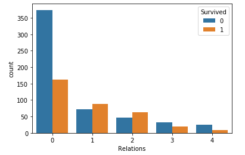

# kaggle-titanic-dataset

Titanic - Machine Learning from Disaster - Kaggle Competiton 

https://www.kaggle.com/c/titanic/overview

I run through the entire machine learning project structure on the Titanic dataset in the Jupyter Notebook [(titanic-kaggle-dataset.ipynb)](titanic-kaggle-dataset.ipynb). 

## The Big Picture and Framing the Problem

This dataset comes from the Titanic Kaggle competition. The goal is relatively simple: Build a predictive model that is able to predict which passengers survived the Titanic disaster based on their passenger data. 

While this is a simple competition dataset, it does have potential real world applications. This type of data may be collected in a study proposed by the government to learn more about a disaster. Alternatively, it could be a business trying to learn from a failure, or simply learning more about their data. Either way, the objective would be a deeper understanding of the data and what that means in context. For a disaster, this might serve as a guiding force for future disaster response in terms of resource allocation, expectations, and considerations. For a business, the problem could have been about product defects on an assembly line based on processing steps. In that case, the model could be used to make adjustments that help eliminate defects, reduce costs, and make future predictions. 

The goal of this specific project is to accurately predict which passengers survived, with an understanding of how the model made that decision. Because the Titanic disaster is a closed off event, it's unlikely the model trained could be used on similar future data (like a modern cruise ship sinking). This is a problem in which we already have all of the data and just want to make predictions on the test set labels. Since the data comes with labels, this is a supervised classification problem. The accuracy of the predictions on the test set will serve to measure performance. 

## Data Collection

In this example we already have all of the data and it's a small dataset that is stored in a CSV file. So all we have to do is get the path to that file and load it up. 

If we didn't have the data, then we would have to get it from the logs of the ship, recorded survivors, or other researchers working on the problem. These sources would have to be verified for their trustworthiness and accuracy. We would also have to consider that the way we are collecting the data helps solve our problem while minimizing environmental noise or bias (like racial discrimination). There may also be government clearances or privacy concerns. If the data came from a variety of sources, then they would need to be converted to the same format and combined with the features properly matched. If this were a problem where we could collect more data, then we would have to consider if and when we would have enough to solve our problem. Additionally, if there was a lot of data, then we would need to consider where it's being stored (perhaps a relational database) and how to access and retrieve it. 

## Data Exploration

Below I'll plot a few of the visualizations created during the data exploration process.

The first is a pairplot, which allows for a quick comparison between all of the numerical features. This also gives a quick histogram for each feature along the diagonal.

The Age, SibSp, Parch, and Fare histograms were all a little right skewed, with the latter three possibly having outliers. I decided to look at these distributions more closely. 

Boxplots were also explored, particularly because they are great at showing outliers. In this case a categorical feature, Embarked, was able to be plotted by comparing it to a numerical feature, Fare. 

The final plot I'll show here is a jointplot between Age and Fare. It's a great way to compare two numerical features and look for possible trends or outliers. 

### Final Data Exploration Notes and Concerns
    
#### Survived
A binary classification - with 0 being died, 1 being survived. This is our target variable. We will want to use classification algorithms that perform binary classification. The classes aren't too skewed. A model "cheating" by saying that everyone died would only have an accuracy of 549/891 = 0.616. 

#### Pclass
Ticket class - A proxy for socio-economic status: 1 - 1st, upper; 2 - 2nd, middle; 3 - 3rd, lower. This is an ordinal categorical variable meaning that the "distance" between each class is not the same. Therefore, it is wise to keep the numerical values. 

#### Name
Being a string object that isn't necessarily categorical, it will be difficult to collect information from.

There does appear to be titles for each passenger, like Mr., Mrs., Master., and Miss. With some preprocessing we may be able to extract these out into a reasonably small number of binary variables. It's possible there's also a fame factor in who survived, but we would have to cross reference names in order to figure that out. 

#### Sex
Male or Female - A binary categorical variable. We will want to convert this to a numerical value, for instance male being 0, and female being 1. 

#### Age
In years, expressed as a fraction if less than 1, and when estimated it is in the form xx.5. Quite a wide variety, but since they appear to be reasonable they should work as numerical data. We will need to fill in missing values, however it's important to consider that a large chunk are missing. 

#### SibSp 
Number of siblings or spouses aboard the titanic. Siblings = brother, sister, stepbrother, stepsister. Spouse = husband, wife (mistresses and fiances were ignored). This is a discrete numerical value.
    
#### Parch
Number of parents or children aboard the titanic. Parent = mother, father. Child = daughter, son, stepdaughter, stepson. Some children only travelled with a nanny, therefore parch=0 for them. So some people travelled together but weren't related. This is a discrete numerical value. 

Both SibSp and Parch are heavily right skwewed with outliers. It seems reasonable to discretize them into groupings of 0, 1, and 2 or more. 

#### Fare
Passenger fare - A continuous numerical value. Possibly has some outliers that should be removed, or the whole feature should be discretized or transformed. 

#### Embarked 
Port of embarkation: C = Cherbourg, Q = Queenstown, S = Southampton. Has two missing values that will need to be handled. These are classes, therefore they will need to be one-hot encoded.

## Data Processing

As with Data Exploration, I'll walk through a few of the Data Processing steps here. 

The first step was to extract the title from each passengers name using regular expressions. A column was created for title and the name column was removed. These titles were also compared to the mean probability of survival. 

After filling in missing values, the SibSp and Parch features were binned to include 0, 1, and 2+ people.

The relations feature was created by combining SibSp and Parch. This feature tells how many total relations a person had on board, including 0, 1, 2, 3, and 4+. It appears that people who traveled alone, or with too many relations, were less likely to survive. 

After encoding the categorical features, the fares feature needed to be transformed to help reduce outliers and create a more normal distribution. The data first had to have a minimum above 0 to work with a log transformation. Next, some of the outliers were capped in order to keep the information that they were expensive, but still work with the transformation. Finally, a log transformation was used on the distribution. 

By looking at the boxplot we can see that there are no longer any outliers. 

In the end, the features that correlated most with Survived were Pclass, Fare, Sex_female, Title_Miss, Title_Mr, and Title_Mrs. 

## Model Selection

This is a binary classification supervised learning problem with a small dataset. Additionally, we'd want to have some degree of explainability in our predictions given the goal of the project. Therefore, neural networks will likely not be ideal here. Given that the dataset is small, training should not take too long. Therefore, I will do a quick first pass for a variety of models, then choose from those which will receive hyperparameter tuning. 

The models I will try are:
- Logistic Regression
- K Nearest Neighbors
- Support Vector Classifier
- Gaussian Naive Bayes
- Linear Discriminant Analysis
- Decision Tree
- Random Forest
- Gradient Boosted Classifier
- AdaBoost
- XGBoost

After the models have been trained, it may be useful to combine the top performers in a voting classifier ensemble.

## Training | Tuning | Metrics

After training the models with cross validation in a quick first pass, these are the results: 

Based on these preliminary results and considering that our small dataset makes for quick training, I'll go 
ahead and tune all of the models except Guassian Naive Bayes and the Decision Tree Classifier. The Decision Tree Classifier performed the worst and will be outperformed by the ensemble tree methods, so I can reasonably drop it. Gaussian Naive Bayes performed the second worst and doesn't have hyperparameters for grid search to tune, therefore it wont perform better. 

Using an example from the scikit-learn website, https://scikit-learn.org/stable/auto_examples/model_selection/plot_learning_curve.html, I set up the function to plot the learning curve, n_samples vs fit_times, and fit_time vs score. 

### Logistic Regression

### K Neighbors Classifier

### Support Vector Classifier

### Linear Discriminant Analysis

### Random Forest Classifier

### Gradient Boosting Classifier

### AdaBoost Classifier

### XGBoost Classifier

### Voting Classifier